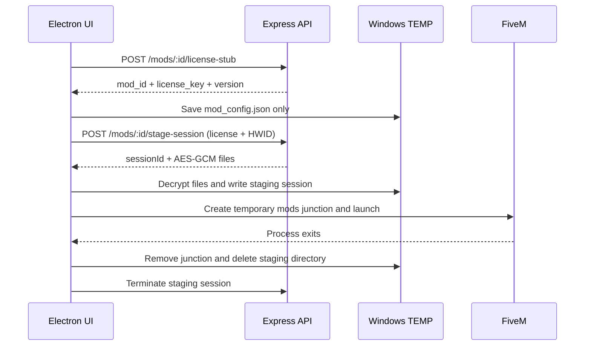
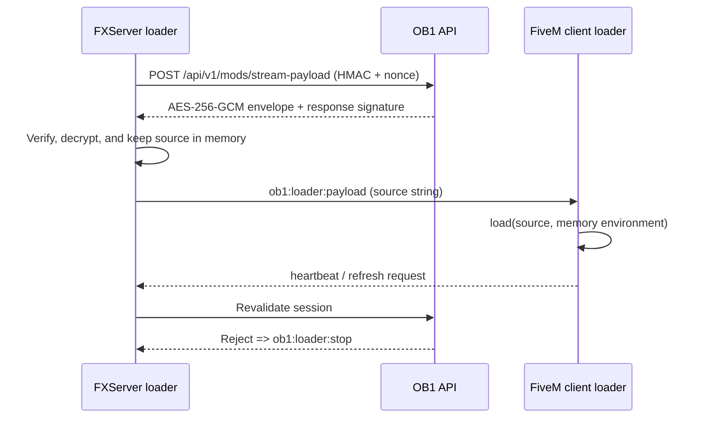

# OB1 Remote Resource

This resource is installed on the FiveM server. FiveM downloads the client DLL automatically when a player joins, while `server/server.js` remains server-side.

## Build layout

Compile the C# project so the output is:

```text
fivem-resource/client/FivemModes.dll
```

The source file is not loaded by FiveM directly.

## Server configuration

Add these convars to `server.cfg` and replace the placeholder secret:

```cfg
set ob1_api_url "https://api.ob1.store"
set ob1_hmac_secret "replace-with-the-same-value-as-FIVEM_HMAC_SECRET"
ensure ob1_remote
```

Keep `ob1_hmac_secret` out of all client files and never define it as a client convar.

## Runtime flow

1. The client emits `ob1:remote:login` to the FiveM server.
2. The server calls the API and stores the short-lived JWT in server memory.
3. The client emits action requests to the FiveM server.
4. The server signs API requests, verifies signed responses, and forwards only the payload.
5. A dropped player loses the in-memory session.

The client still receives a DLL, so it can be inspected by the player. Temporary delivery and obfuscation can slow copying, but cannot make client code inaccessible. Sensitive decisions and secrets stay server-side.

## Per-mod resources

For a server-owned resource per mod, an authenticated administrator can download:

```text
GET /api/mods/:modId/resource?type=mods
```

The API generates a ZIP containing an `ob1_<modId>` resource with `fxmanifest.lua` and a server-side heartbeat script. Install that folder under `resources/[ob1]/` on FXServer and add:

```cfg
set ob1_api_url "https://api.ob1.store"
set ob1_hmac_secret "same-secret-as-the-API"
ensure ob1_<modId>
```

This resource reports its startup and periodic heartbeat to the API. It does not put API secrets or server scripts on the FiveM client. A launcher on a player machine cannot install or enable a resource on a remote FXServer without administrator deployment access.

## Dynamic in-memory payload loader

Each mod must have a server-side `payload.lua` stored with its API plugin data. It is never included in the client resource ZIP. Configure the generated resource on FXServer:

```cfg
set ob1_api_url "https://api.ob1.store"
set ob1_hmac_secret "same-secret-as-the-API"
set ob1_mod_id "your-mod-id"
set ob1_license_key "license-key-for-this-server"
ensure ob1_remote
```

On resource start, `server/server.js` requests `/api/v1/mods/stream-payload`, verifies the signed response, decrypts the payload in FXServer memory, and sends it to `client/loader.lua`. The client executes it with Lua `load()` and never writes the payload to disk. Heartbeat/reload failures stop the loader.

The payload is client-visible while executing. Keep economy, permissions, license decisions, and other sensitive logic in the server loader or API; in-memory execution is not a confidentiality boundary against the player who controls the FiveM client.

## On-demand staging flow



The legacy raw ZIP/RPF download routes return `410 Gone`; the launcher must use the stub and staging endpoints.



## Secure launcher integration

The API exposes an authenticated endpoint for an explicitly selected version:

```text
POST /api/mods/:modId/secure-session?type=versions
```

It returns a short-lived AES-256-GCM envelope. The Electron launcher passes that envelope to `window.electron.launchSecureFiveM(...)`; decrypted files are written only when FiveM starts and are removed when the process exits. Existing files are never overwritten by the secure path.

L1 and L2 use this path when the launcher knows the latest downloaded version. If no version is known or the secure endpoint fails, they retain the existing legacy launch behavior.